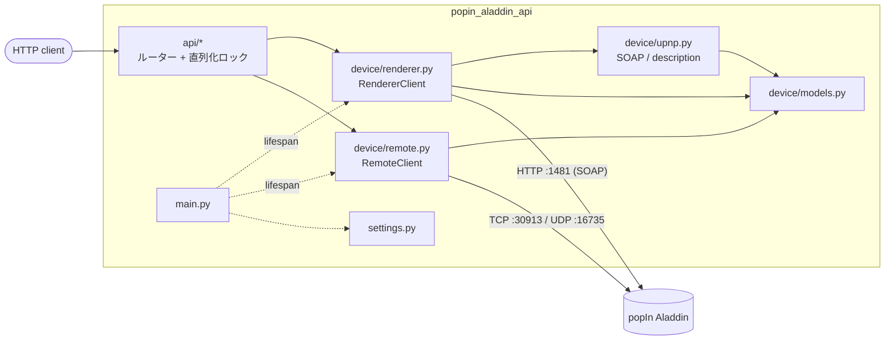

# popIn Aladdin API

天井照明付きプロジェクター **popIn Aladdin** (実機の UPnP フレンドリ名は `Aladdin 2`) を、
クラウドを介さず同一 LAN から操作する REST サーバーです。FastAPI + pydantic で
次の 2 系統の制御面をラップします。

1. **UPnP/DLNA MediaRenderer** (標準仕様、Platinum 実装) — 再生状態・音量・任意メディア URL のキャスト
2. **独自 popIn/MAXHUB 制御プロトコル** — シーリングライト、方向キー / ハードキー、
   オンスクリーンキーボードへの文字入力、音声コマンド

> 認証はありません。LAN 内の誰でも読み書きできる前提で運用してください。

## セットアップ

```bash
make setup        # uv sync
```

接続先を変えるときはリポジトリ直下に `.env` を作って指定します。全て省略可で、既定値は次のとおりです。

| 変数                 | 既定値                | 説明                                                   |
| -------------------- | --------------------- | ------------------------------------------------------ |
| `POPIN_ALADDIN_HOST` | `http://172.16.1.113` | デバイスの URL またはホスト名 / IP (ポートは含めない) |
| `UPNP_PORT`          | `1481`                | UPnP/DLNA MediaRenderer のポート                       |
| `DESCRIPTION_PATH`   | `/`                   | UPnP device description のパス                         |
| `CONTROL_TCP_PORT`   | `30913`               | 独自プロトコル TCP (ライト・文字入力・音声)            |
| `CONTROL_UDP_PORT`   | `16735`               | 独自プロトコル UDP (方向キー・ハードキー・保守)        |
| `TIMEOUT`            | `10`                  | デバイスへの各リクエストのタイムアウト (秒)            |

## 起動

```bash
make run          # uv run uvicorn popin_aladdin_api.main:app --reload --host 127.0.0.1 --port 8000
```

Swagger UI: http://127.0.0.1:8000/docs

### Docker

```bash
make build-image  # docker build -t popin-aladdin-api:latest .
make run-image    # docker run --rm -p 8000:8000 [--env-file .env] popin-aladdin-api:latest
```

`.env` があれば `--env-file` でコンテナに渡します。

`uv` ビルダで依存とパッケージを `.venv` にインストールし、`python:slim` ランナーへ
`.venv` だけをコピーして非 root で実行します。

## エンドポイント

パスの接頭辞は `/api` です。

| Method | Path                  | 説明                                                         |
| ------ | --------------------- | ------------------------------------------------------------ |
| GET    | `/api/health`         | サーバー状態と接続先 (デバイスには触れない)                  |
| GET    | `/api/info`           | デバイス情報 (friendly_name / model / UDN / services)        |
| GET    | `/api/status`         | 集約状態 (state / volume / mute / 現在 URI / 位置)           |
| GET    | `/api/transport`      | 再生状態 (state / status / speed)                            |
| GET    | `/api/position`       | 再生位置・トラック情報                                       |
| GET    | `/api/media`          | 現在のメディア情報 (URI / duration)                          |
| GET    | `/api/protocol-info`  | 対応プロトコル (source / sink)                               |
| GET    | `/api/volume`         | 音量取得                                                     |
| POST   | `/api/volume`         | 音量設定 (`volume`: 0..100)                                  |
| GET    | `/api/mute`           | ミュート状態取得                                             |
| POST   | `/api/mute`           | ミュート設定 (`mute`)                                        |
| POST   | `/api/play`           | 再生 (任意で `speed`)                                        |
| POST   | `/api/pause`          | 一時停止                                                     |
| POST   | `/api/stop`           | 停止                                                         |
| POST   | `/api/next`           | 次のトラック                                                 |
| POST   | `/api/previous`       | 前のトラック                                                 |
| POST   | `/api/seek`           | シーク (`seconds`)                                           |
| POST   | `/api/play-mode`      | 再生モード設定 (`mode`)                                      |
| POST   | `/api/cast`           | 任意メディア URL を読み込んで再生 (`uri` ほか)               |
| GET    | `/api/remote/buttons` | 利用できるボタン名一覧 (light / key / key_stateless)         |
| POST   | `/api/remote/ping`    | 独自プロトコル (TCP) の疎通確認                              |
| POST   | `/api/light`          | シーリングライト操作 (`button` + `repeat`)                   |
| POST   | `/api/key`            | 方向キー / ハードキー入力 (`button` + `repeat`)              |
| POST   | `/api/keyboard`       | オンスクリーンキーボードへ文字入力 (`text`)                  |
| POST   | `/api/voice`          | 音声コマンドをテキストとして送信 (`text`)                    |
| POST   | `/api/memory/free`    | バックグラウンドアプリのメモリ解放                           |
| POST   | `/api/capture`        | デバイスの capture コマンド送信                              |
| POST   | `/api/soap`           | 任意 SOAP アクションのパススルー (状態を変えうるものは `confirm` 必須) |

リクエスト / レスポンスの全スキーマは Swagger UI で確認できます。

### エラー

| Status | 意味                                                                          |
| ------ | ----------------------------------------------------------------------------- |
| 400    | `/api/soap` で状態を変えうるアクションに `confirm: true` が無い              |
| 422    | リクエスト body の検証エラー (未知のボタン名・範囲外の音量など)               |
| 502    | デバイスが SOAP fault や想定外の応答を返した。SOAP fault なら body に `fault_code` (SOAP faultcode) と `upnp_error_code` (UPnPError errorCode) を含む |
| 504    | デバイスにネットワーク的に到達できない (接続拒否・タイムアウト)               |

### 使用例

```bash
# 集約状態
curl http://127.0.0.1:8000/api/status
# {"state":"PLAYING","status":"OK","volume":35,"mute":false,
#  "current_uri":"http://192.168.1.50:8200/video/sample.mp4",
#  "track_duration_seconds":212.0,"position_seconds":30.0}

# 音量
curl -X POST http://127.0.0.1:8000/api/volume \
  -H 'Content-Type: application/json' -d '{"volume": 40}'

# キャスト (LAN 上から到達できるメディア URL。DIDL-Lite メタデータは自動生成)
curl -X POST http://127.0.0.1:8000/api/cast \
  -H 'Content-Type: application/json' \
  -d '{"uri":"http://192.168.1.50:8200/video/sample.mp4","upnp_class":"object.item.videoItem"}'

# ライト: 点灯 / 明るさを 10 段階上げる
curl -X POST http://127.0.0.1:8000/api/light \
  -H 'Content-Type: application/json' -d '{"button":"on"}'
curl -X POST http://127.0.0.1:8000/api/light \
  -H 'Content-Type: application/json' -d '{"button":"brighter","repeat":10}'

# リモコン: カーソルを下へ → 決定
curl -X POST http://127.0.0.1:8000/api/key \
  -H 'Content-Type: application/json' -d '{"button":"down"}'
curl -X POST http://127.0.0.1:8000/api/key \
  -H 'Content-Type: application/json' -d '{"button":"ok"}'

# 文字入力
curl -X POST http://127.0.0.1:8000/api/keyboard \
  -H 'Content-Type: application/json' -d '{"text":"hello world"}'

# 汎用 SOAP: 読み取りは confirm 不要、書き込みは confirm 必須
curl -X POST http://127.0.0.1:8000/api/soap \
  -H 'Content-Type: application/json' \
  -d '{"service":"AVTransport","action":"GetTransportInfo","args":{"InstanceID":0}}'
curl -X POST http://127.0.0.1:8000/api/soap \
  -H 'Content-Type: application/json' \
  -d '{"service":"RenderingControl","action":"SetVolume","args":{"InstanceID":0,"Channel":"Master","DesiredVolume":20},"confirm":true}'
```

ライトの `button`: `switch` `brighter` `darker` `cooler` `warmer` `full` `night`
`on` `off` `eco` `sleep`
キーの `button`: 方向キー `up` `down` `left` `right` `ok` `home` / ハードキー
`back` `menu` `vol_up` `vol_down` `power`

## 開発

ruff (lint + formatter)、ty (型チェック)、pytest、pre-commit を使います。

```bash
make format              # ruff format
make lint                # ruff format --check + ruff check + ty check (CI 相当)
make test                # coverage run -m pytest + report
make precommit-install   # フックを git に登録
make precommit           # 全ファイルに対して実行
```

テストは実機に触れず、`httpx.MockTransport` と localhost の TCP / UDP サーバーで
プロトコルを検証します。

## 構成

`src/` レイアウトの単一パッケージで、`uv sync` で `.venv` にインストールされます。

```
src/popin_aladdin_api/
  settings.py        環境変数 / .env の設定 (pydantic-settings)
  main.py            FastAPI アプリ、lifespan、device 層の例外 → HTTP status
  device/            FastAPI 非依存のデバイス制御層 (async)
    renderer.py      UPnP/DLNA MediaRenderer クライアント (httpx)
    remote.py        独自プロトコル クライアント (asyncio TCP / UDP)
    upnp.py          SOAP / device description / DIDL-Lite の純粋関数
    models.py        列挙型 (PlayMode / LightButton / ProjectorKey) と応答モデル
    errors.py        AladdinError / AladdinConnectionError / AladdinSoapError
  api/               FastAPI ルーター
    renderer.py      再生・音量・キャスト・SOAP パススルー
    remote.py        ライト・キー・文字入力・音声・保守
    system.py        /health
    schemas.py       リクエストモデル
    deps.py          依存性注入と直列化ロック
tests/               src と同じ木構造のオフライン単体テスト
```



デバイスに触るリクエストはプロセス内の 1 つの `asyncio.Lock` で直列化します。
複数 SOAP 呼び出しから成る操作 (cast, status) の途中に別リクエストが割り込まず、
D-pad の押下 → 離上列も崩れません。同じ理由で uvicorn は単一プロセス
(`--workers 1`) で運用してください。

UPnP device description はプロセス生存中キャッシュします。UDN と controlURL は
MAC アドレス由来で機体ごとに固定なため、通常は再取得不要です。機体を入れ替えた
場合はサーバーを再起動してください。

## プロトコルの詳細

### UPnP/DLNA MediaRenderer

```
GET  http://<host>:1481/                              … UPnP device description
POST http://<host>:1481/<Service>/<UDN>/control.xml   … SOAP コントロール
```

device description から各サービスの `controlURL` を解決し、SOAP でアクションを
呼びます。公開サービスは次の 3 つです。

| サービス              | 主なアクション                                                                                                              |
| --------------------- | --------------------------------------------------------------------------------------------------------------------------- |
| **AVTransport**       | GetTransportInfo / GetPositionInfo / GetMediaInfo / Play / Pause / Stop / Next / Previous / Seek / SetAVTransportURI / SetPlayMode |
| **RenderingControl**  | GetVolume / SetVolume (0..100) / GetMute / SetMute                                                                          |
| **ConnectionManager** | GetProtocolInfo                                                                                                             |

### 独自プロトコル (popIn/MAXHUB)

popIn Aladdin は内部的に MAXHUB (CVTE) のモバイル制御プロトコルを使っています。
公式アプリのライト操作・リモコン入力はこの経路です。認証・ハンドシェイク・暗号化は
ありません。プロトコル定数は
[kmaehashi/popin-aladdin-light](https://github.com/kmaehashi/popin-aladdin-light)
(MIT) の解析に基づきます。

- **TCP 30913**: 6 バイトヘッダ `struct '<IBB'` (uint32 ペイロード長 + uint8 `op1`
  + uint8 `op2`) + JSON ペイロード。
  - ライト: `op1=1, op2=7, {"action": <code>}` (switch=31, brighter=32, darker=33,
    cooler=34, warmer=35, full=36, night=37, on=38, off=39, eco=40, sleep=41)
  - 文字入力: `op1=1, op2=10, {"text": "..."}`
  - 音声: `op1=1, op2=9, {"text": "...", "success": true}`
  - ping: `op1=0, op2=0, payload=1` → 6 バイトの null 応答
- **UDP 16735**: ASCII データグラム / JSON。
  - 方向キー (押下 / 離上): `KEYSSTATUS:<key>+<1|0>` (home=35, up=36, right=37,
    down=38, ok=49, left=50)。離上時は全方向キーを離上した後、押したキーをもう一度
    離上する (デバイスが期待する列)。
  - ハードキー (単発): `KEYPRESSES:<key>` (back=48, vol_up=115, vol_down=114,
    power=116, menu=139)
  - 保守コマンド: JSON `{"action": 20000, "controlCmd": {"mode": 9, "type": <1|2>,
    "time": 0}}` (type=2 メモリ解放, type=1 capture)

デバイスは他にも AirPlay (7000/7100) や AndServer (7434) を公開していますが、本 API
の対象外です。

## 注意

- 同一サブネットからの利用を想定しています。認証はありません。
- ファームウェアや機体によって UDN・ポート・公開サービスが異なる場合があります。
  UPnP のパスは device description から解決するため多くは自動追従しますが、
  独自プロトコルのポートは `.env` で変更してください。

## 免責 / Disclaimer

本プロジェクトは **popIn Aladdin 非公式**であり、メーカーとは一切関係ありません。

- **自分が管理権限を持つ機器に対してのみ**使用してください。
- ファームウェア更新で挙動が変わる可能性があります。
- 本ソフトウェアは現状有姿 (AS IS) で提供され、いかなる保証もありません。

## ライセンス / License

[MIT](LICENSE)
