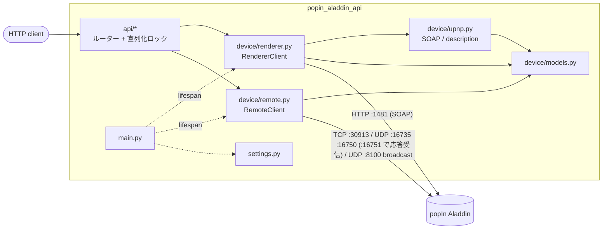

# popIn Aladdin API

[](https://github.com/msageha/popin-aladdin-api/actions/workflows/ci.yaml)

天井照明付きプロジェクター **popIn Aladdin** (実機の UPnP フレンドリ名は `Aladdin 2`) を、
クラウドを介さず同一 LAN から操作する REST サーバーです。FastAPI + pydantic で
次の 2 系統の制御面をラップします。

1. **UPnP/DLNA MediaRenderer** (標準仕様、Platinum 実装) — 再生状態・音量・任意メディア URL のキャスト
2. **独自制御プロトコル** (popIn 独自の TCP と、XGIMI GMSDK 由来の UDP) — シーリングライト、
   方向キー / ハードキー、文字入力、音声コマンド、deeplink によるアプリ起動、デバイス情報、
   スクリーンショット、電源断、LAN 内のデバイス発見

> 認証はありません。LAN 内の誰でも読み書きできる前提で運用してください。

## セットアップ

[mise](https://mise.jdx.dev/) の利用を前提としています。

```bash
mise trust    # 初回のみ: このディレクトリの mise.toml を信頼する
mise install  # tools をインストールし、git hooks (prek) を登録する
```

Python 本体 (`.python-version` の 3.14) と `.venv` は、最初の `uv run` (`mise run dev` / `mise run test` 等) で uv が
`uv.lock` どおりに用意します。

接続先を変えるときはリポジトリ直下に `.env` を作って指定します。全て省略可で、既定値は次のとおりです。

| 変数                     | 既定値                | 説明                                                                                  |
| ------------------------ | --------------------- | ------------------------------------------------------------------------------------- |
| `POPIN_ALADDIN_HOST`     | `http://172.16.1.113` | デバイスの URL またはホスト名 / IP (ポートは含めない)                                 |
| `UPNP_PORT`              | `1481`                | UPnP/DLNA MediaRenderer のポート                                                      |
| `DESCRIPTION_PATH`       | `/`                   | UPnP device description のパス                                                        |
| `CONTROL_TCP_PORT`       | `30913`               | 独自プロトコル TCP (ライト・文字入力・音声・deeplink・照会)                           |
| `CONTROL_UDP_PORT`       | `16735`               | 独自プロトコル UDP (方向キー・ハードキー)                                             |
| `CONTROL_CMD_UDP_PORT`   | `16750`               | 独自プロトコル UDP JSON コマンド (スクリーンショット・メモリ解放・実行時情報・電源断) |
| `CONTROL_REPLY_UDP_PORT` | `16751`               | UDP JSON コマンドの応答を受け取るこのサーバー側のポート                               |
| `DISCOVERY_UDP_PORT`     | `8100`                | デバイス発見のブロードキャスト先ポート                                                |
| `TIMEOUT`                | `10`                  | デバイスへの各リクエストのタイムアウト (秒)                                           |

## 起動

```bash
mise run dev      # uv run uvicorn popin_aladdin_api.main:app --reload --host 127.0.0.1 --port 8000
```

Swagger UI: http://127.0.0.1:8000/docs

### Docker

```bash
mise run build-image  # docker build -t popin-aladdin-api:latest .
mise run run-image    # docker run --rm -p 8000:8000 [--env-file .env] popin-aladdin-api:latest
```

`.env` があれば `--env-file` でコンテナに渡します。UDP JSON コマンドの応答 (`/api/capture`、`/api/remote/device`) は
デバイスからこのサーバーの `CONTROL_REPLY_UDP_PORT` (既定 16751) に届くため、bridge ネットワークでは
`-p 16751:16751/udp` の公開が必要です。`/api/discover` のブロードキャストは bridge ネットワークからは LAN に届かないので、
`--network host` で動かすか、ホスト上で直接起動してください。

`uv` ビルダで依存とパッケージを `.venv` にインストールし、`python:slim` ランナーへ
`.venv` だけをコピーして非 root で実行します。

## エンドポイント

パスの接頭辞は `/api` です。

| Method | Path                         | 説明                                                                      |
| ------ | ---------------------------- | ------------------------------------------------------------------------- |
| GET    | `/api/health`                | サーバー状態と接続先 (デバイスには触れない)                               |
| GET    | `/api/info`                  | デバイス情報 (friendly_name / model / UDN / services)                     |
| GET    | `/api/status`                | 集約状態 (state / volume / mute / 現在 URI / 位置)                        |
| GET    | `/api/transport`             | 再生状態 (state / status / speed)                                         |
| GET    | `/api/position`              | 再生位置・トラック情報                                                    |
| GET    | `/api/media`                 | 現在のメディア情報 (URI / duration)                                       |
| GET    | `/api/protocol-info`         | 対応プロトコル (source / sink)                                            |
| GET    | `/api/volume`                | 音量取得                                                                  |
| POST   | `/api/volume`                | 音量設定 (`volume`: 0..100)                                               |
| GET    | `/api/mute`                  | ミュート状態取得                                                          |
| POST   | `/api/mute`                  | ミュート設定 (`mute`)                                                     |
| POST   | `/api/play`                  | 再生 (任意で `speed`)                                                     |
| POST   | `/api/pause`                 | 一時停止                                                                  |
| POST   | `/api/stop`                  | 停止                                                                      |
| POST   | `/api/next`                  | 次のトラック                                                              |
| POST   | `/api/previous`              | 前のトラック                                                              |
| POST   | `/api/seek`                  | シーク (`seconds`)                                                        |
| POST   | `/api/play-mode`             | 再生モード設定 (`mode`)                                                   |
| POST   | `/api/cast`                  | 任意メディア URL を読み込んで再生 (`uri` ほか)                            |
| GET    | `/api/remote/buttons`        | 利用できるボタン名一覧 (light / key / key_stateless)                      |
| POST   | `/api/remote/ping`           | 独自プロトコル (TCP) の疎通確認                                           |
| GET    | `/api/remote/version`        | 機種・OS・ストレージ・機能一覧 (TCP の Version ハンドシェイク) ※          |
| GET    | `/api/remote/album`          | フォトメモリーの枚数・容量とライト部のファームウェア版 ※                  |
| GET    | `/api/remote/apps/{package}` | アプリのインストール有無と版 ※                                            |
| GET    | `/api/remote/device`         | 前面アプリなど実行時の情報 (UDP JSON コマンド) ※                          |
| GET    | `/api/discover`              | LAN にブロードキャストして Aladdin を探す (`wait` 秒待つ) ※               |
| POST   | `/api/light`                 | シーリングライト操作 (`button` + `repeat`)                                |
| POST   | `/api/key`                   | 方向キー / フォーカス調整 / 長押し / ハードキー入力 (`button` + `repeat`) |
| POST   | `/api/keyboard`              | オンスクリーンキーボードへ文字入力 (`text`)                               |
| POST   | `/api/voice`                 | 音声コマンドをテキストとして送信 (`text`)                                 |
| POST   | `/api/deeplink`              | deeplink をデバイスで開く = アプリ起動 (`url`) ※                          |
| POST   | `/api/memory/free`           | バックグラウンドアプリのメモリ解放 ※                                      |
| POST   | `/api/capture`               | 画面を撮影させ、デバイス上の画像 URL を返す ※                             |
| POST   | `/api/power/off`             | 電源を切る (`confirm: true` 必須。再点灯はこの API からできない) ※        |
| POST   | `/api/soap`                  | 任意 SOAP アクションのパススルー (状態を変えうるものは `confirm` 必須)    |

※ 印は公式アプリ (Aladdin X 3.6.25) の静的解析で復元したコマンドで、実機での動作は未確認です
(詳細は「プロトコルの詳細」)。ライト・方向キー・`back` `menu` `vol_up` `vol_down` `power`・文字入力・音声・ping は
kmaehashi/popin-aladdin-light の実測で動作が確認されています。`/api/key` のそれ以外のキー
(`focus_*` / `home_long` / `menu_long` / `settings` / `netflix` / `youtube` / `prime_video` / `custom*`) は静的解析のみです。

リクエスト / レスポンスの全スキーマは Swagger UI で確認できます。

### エラー

| Status | 意味                                                                                                                                                  |
| ------ | ----------------------------------------------------------------------------------------------------------------------------------------------------- |
| 400    | `/api/soap` で状態を変えうるアクションと `/api/power/off` に `confirm: true` が無い                                                                   |
| 422    | リクエスト body の検証エラー (未知のボタン名・範囲外の音量など)                                                                                       |
| 502    | デバイスが SOAP fault や想定外の応答を返した。SOAP fault なら body に `fault_code` (SOAP faultcode) と `upnp_error_code` (UPnPError errorCode) を含む |
| 504    | デバイスにネットワーク的に到達できない (接続拒否・タイムアウト)、または UDP JSON コマンドの応答が `TIMEOUT` 秒以内に届かない                          |

### 使用例

```bash
# 集約状態
curl http://127.0.0.1:8000/api/status
# {"state":"PLAYING","status":"OK","volume":35,"mute":false,
#  "current_uri":"http://192.168.1.50:8200/video/sample.mp4",
#  "track_duration_seconds":212.0,"position_seconds":30.0}

# 音量
curl -X POST http://127.0.0.1:8000/api/volume \
  -H 'Content-Type: application/json' -d '{"volume": 40}'

# キャスト (LAN 上から到達できるメディア URL。DIDL-Lite メタデータは自動生成)
curl -X POST http://127.0.0.1:8000/api/cast \
  -H 'Content-Type: application/json' \
  -d '{"uri":"http://192.168.1.50:8200/video/sample.mp4","upnp_class":"object.item.videoItem"}'

# ライト: 点灯 / 明るさを 10 段階上げる
curl -X POST http://127.0.0.1:8000/api/light \
  -H 'Content-Type: application/json' -d '{"button":"on"}'
curl -X POST http://127.0.0.1:8000/api/light \
  -H 'Content-Type: application/json' -d '{"button":"brighter","repeat":10}'

# リモコン: カーソルを下へ → 決定
curl -X POST http://127.0.0.1:8000/api/key \
  -H 'Content-Type: application/json' -d '{"button":"down"}'
curl -X POST http://127.0.0.1:8000/api/key \
  -H 'Content-Type: application/json' -d '{"button":"ok"}'

# 文字入力
curl -X POST http://127.0.0.1:8000/api/keyboard \
  -H 'Content-Type: application/json' -d '{"text":"hello world"}'

# アプリ起動 (deeplink) / YouTube ショートカットキー
curl -X POST http://127.0.0.1:8000/api/deeplink \
  -H 'Content-Type: application/json' -d '{"url":"https://www.youtube.com/tv"}'
curl -X POST http://127.0.0.1:8000/api/key \
  -H 'Content-Type: application/json' -d '{"button":"youtube"}'

# デバイス情報 (機種・機能一覧) と前面アプリ
curl http://127.0.0.1:8000/api/remote/version
curl http://127.0.0.1:8000/api/remote/device

# スクリーンショット (返る URL はデバイスと同じ LAN から取得する)
curl -X POST http://127.0.0.1:8000/api/capture
# {"action":"capture","image_url":"http://172.16.1.113:.../....png"}

# LAN 内の Aladdin を探す
curl 'http://127.0.0.1:8000/api/discover?wait=3'

# 電源を切る (confirm 必須)
curl -X POST http://127.0.0.1:8000/api/power/off \
  -H 'Content-Type: application/json' -d '{"confirm":true}'

# 汎用 SOAP: 読み取りは confirm 不要、書き込みは confirm 必須
curl -X POST http://127.0.0.1:8000/api/soap \
  -H 'Content-Type: application/json' \
  -d '{"service":"AVTransport","action":"GetTransportInfo","args":{"InstanceID":0}}'
curl -X POST http://127.0.0.1:8000/api/soap \
  -H 'Content-Type: application/json' \
  -d '{"service":"RenderingControl","action":"SetVolume","args":{"InstanceID":0,"Channel":"Master","DesiredVolume":20},"confirm":true}'
```

ライトの `button`: `switch` `brighter` `darker` `cooler` `warmer` `full` `night`
`on` `off` `eco` `sleep`
キーの `button`: 方向キー `up` `down` `left` `right` `ok` `home` / フォーカス調整 `focus_plus` `focus_minus` /
長押し `home_long` `menu_long` / ハードキー `back` `menu` `vol_up` `vol_down` `power` (電源メニュー)
`settings` `netflix` `youtube` `prime_video` `custom` `custom_long` (リモコンのカスタムボタン)

## 開発

ツール (uv / prek / dprint / actionlint / shellcheck / hadolint / gitleaks / fnox) は `mise.toml` の `[tools]` で
exact version に pin し、`mise.lock` でプラットフォームごとの URL / checksum を固定します。CI (`ci.yaml`) も
ローカルも同じ `mise.lock` からツールを解決するため、同じ検証をローカルで再現できます。`[tools]` を手で変更したら
`mise lock` を実行して `mise.lock` を追従させ、両方を同じ commit に含めてください (古いままだと CI の
`mise install --locked` が失敗します)。Python 本体は mise ではなく uv が `.python-version` (3.14) に従って取得します。
[fnox](https://fnox.jdx.dev/) は暗号化ファイル・パスワードマネージャ等から secret を読み込んで環境変数として
コマンドに渡す secret manager で、`fnox.toml` はその daemon (解決済み secret のメモリキャッシュ。12h 無操作で終了) の
設定です。この API 自体に secret は無く、template との共通設定として置いています。

```bash
mise run format                     # ruff format
mise run lint                       # ruff format --check + ruff check + ty check
mise run test                       # coverage run -m pytest + report
mise exec -- prek run --all-files   # pre-commit hooks を全ファイルに対して実行する (CI の prek job と同じ)
```

テストは実機に触れず、`httpx.MockTransport` と localhost の TCP / UDP サーバーで
プロトコルを検証します。

### pre-commit hooks

`mise install` の `postinstall` hook で `prek install` が実行され、`.git/hooks/pre-commit` と
`.git/hooks/commit-msg` が登録されます。`.pre-commit-config.yaml` の hook 構成が変わったあとの既存 clone では
`mise exec -- prek install` を再実行してください。以前 pre-commit (Python package。旧 `make precommit-install`) で
hook を登録した clone では、`prek install` が旧 hook を `.git/hooks/pre-commit.legacy` として残して呼び続け、
`pre-commit` が `.venv` から消えた後は commit が失敗します。`mise exec -- prek install --force` で置き換えてください
(prek 以外の hook を自分で置いている場合は `.git/hooks/*.legacy` の中身を確認してから)。

- [ruff](https://docs.astral.sh/ruff/) (format + lint) と [ty](https://docs.astral.sh/ty/) (型チェック) は
  `uv run --locked` で `uv.lock` のバージョンを使い、pre-commit 側と二重管理しません。`uv.lock` が
  `pyproject.toml` に追従していないと hook (と CI) がここで失敗します。
- [dprint](https://dprint.dev/): json / markdown / toml / yaml のフォーマッタ。plugin の WASM URL は
  `dprint.json` に `url@sha256` の checksum 付きで pin します。
- [actionlint](https://github.com/rhysd/actionlint): workflow の静的検査。`run:` スクリプトの検査に
  [shellcheck](https://github.com/koalaman/shellcheck) を使います。
- [hadolint](https://github.com/hadolint/hadolint): Dockerfile の静的検査。
- [gitleaks](https://github.com/gitleaks/gitleaks): シークレットスキャン。pre-commit hook が staged 差分を、
  CI の `gitleaks` job がコミット履歴全体を対象にします。
- [commitlint](https://commitlint.js.org/): commit message を
  [Conventional Commits](https://www.conventionalcommits.org/) (`type(scope): subject`) で検査する commit-msg hook。
  ルールは `commitlint.config.mjs`。prek が node を自前で用意するため、リポジトリに node は不要です。

`.gitignore` はホワイトリスト方式 (`*` で全て無視し、`!` で許可したものだけを追跡する) です。
新しく追跡したいファイルを追加する場合は、対応する `!` の行を追記してください。

### CI

`.github/workflows/ci.yaml` は pull request 時に以下の job を並列実行します。job 名がそのまま
required status check の名前になります。

- `prek`: `mise.lock` 通りのツールで `.pre-commit-config.yaml` の全 hook を `prek run --all-files` で実行する。
- `gitleaks`: コミット履歴全体を対象にシークレットスキャンを行う。
- `verify`: `uv run --locked pytest` でテストを実行する。

main への push では実行しません (main は PR 必須で、変更は PR の CI で検証してから merge します)。
workflow の外部依存 (`uses:`) は commit SHA で固定し、バージョンをコメントで併記します。

### 依存関係の更新 (Renovate)

`renovate.json` で以下を [Renovate](https://docs.renovatebot.com/) に任せます。Renovate GitHub App をこの
リポジトリに対して有効化しておく必要があります。

- `pyproject.toml` の依存と `uv.lock` (範囲内の更新は `lockFileMaintenance` の週次再解決で追従する)。
- `mise.toml` のバージョン bump と、それに伴う `mise.lock` の更新 (同じ PR で行われる)。
- `.pre-commit-config.yaml` の hook `rev` と、`language: node` の hook の `additional_dependencies`。
- workflow の `uses:` の commit SHA と、`dprint.json` の plugin URL / checksum。
- `Dockerfile` のベースイメージ (runner の `python:*` のみ。builder の `uv:python3.14-*` は tag を解釈できず対象外なので、
  両者がずれないよう docker datasource の更新は automerge せず人手で揃える)。

major 以外の更新は 1 つの PR に集約し、minor / patch は `minimumReleaseAge` (7 日) 経過後、CI green を条件に
Renovate 自身が自動マージします (`platformAutomerge: false`)。major は個別 PR で人手レビューします。

### GitHub リポジトリ設定

ファイルとして管理できないリポジトリ設定です。public リポジトリなので ruleset と secret scanning が使えます。
required checks は `ci.yaml` の job 名 (`prek` / `gitleaks` / `verify`) に合わせます。

```sh
REPO=msageha/popin-aladdin-api

# merge 方式: squash のみ / squash タイトルは COMMIT_OR_PR_TITLE / merge 後にブランチ自動削除 / wiki off
gh api -X PATCH "repos/$REPO" --input - <<'JSON'
{
  "allow_merge_commit": false,
  "allow_rebase_merge": false,
  "allow_squash_merge": true,
  "squash_merge_commit_title": "COMMIT_OR_PR_TITLE",
  "squash_merge_commit_message": "COMMIT_MESSAGES",
  "delete_branch_on_merge": true,
  "has_wiki": false
}
JSON

# main を PR 必須・CI green 必須・squash merge 限定・force push / 削除禁止・linear history にする
gh api -X POST "repos/$REPO/rulesets" --input - <<'JSON'
{
  "name": "Protect main",
  "target": "branch",
  "enforcement": "active",
  "bypass_actors": [],
  "conditions": {"ref_name": {"include": ["refs/heads/main"], "exclude": []}},
  "rules": [
    {"type": "deletion"},
    {"type": "non_fast_forward"},
    {"type": "required_linear_history"},
    {"type": "pull_request", "parameters": {
      "required_approving_review_count": 0,
      "dismiss_stale_reviews_on_push": false,
      "require_code_owner_review": false,
      "require_last_push_approval": false,
      "required_review_thread_resolution": false,
      "allowed_merge_methods": ["squash"]
    }},
    {"type": "required_status_checks", "parameters": {
      "do_not_enforce_on_create": false,
      "strict_required_status_checks_policy": false,
      "required_status_checks": [
        {"context": "prek", "integration_id": 15368},
        {"context": "gitleaks", "integration_id": 15368},
        {"context": "verify", "integration_id": 15368}
      ]
    }}
  ]
}
JSON

# secret scanning: push protection に加え、non-provider patterns も有効化する
gh api -X PATCH "repos/$REPO" --input - <<'JSON'
{
  "security_and_analysis": {
    "secret_scanning": {"status": "enabled"},
    "secret_scanning_push_protection": {"status": "enabled"},
    "secret_scanning_non_provider_patterns": {"status": "enabled"}
  }
}
JSON

# Actions: GitHub 公式 / verified creator と、workflow が使う action だけを許可し、SHA pin を必須にする
gh api -X PUT "repos/$REPO/actions/permissions" --input - <<'JSON'
{"enabled": true, "allowed_actions": "selected", "sha_pinning_required": true}
JSON
gh api -X PUT "repos/$REPO/actions/permissions/selected-actions" --input - <<'JSON'
{"github_owned_allowed": true, "verified_allowed": true, "patterns_allowed": ["jdx/mise-action@*"]}
JSON

# Dependabot alerts (脆弱性の通知のみ。更新 PR は Renovate が出すので security updates は有効化しない)
gh api -X PUT "repos/$REPO/vulnerability-alerts"
```

### template との同期

開発ツール・CI・GitHub 設定ファイルは [dope-corp/template](https://github.com/dope-corp/template) に由来します
(template の `claude.yaml` / `claude-sweep.yaml` は、このリポジトリで GitHub 経由の Claude Code を使わないため取り込んでいません)。
template 側で入った更新は自動では届かないため、`mise run template-diff` で共通ファイルを template の main と比較して
unified diff を表示します。差分にはこのリポジトリ固有の変更 (Python 向けの hook・`verify` job 等) も混ざるので、
取り込むものは手で選んでください。

## 構成

`src/` レイアウトの単一パッケージで、`uv sync` で `.venv` にインストールされます。

```
src/popin_aladdin_api/
  settings.py        環境変数 / .env の設定 (pydantic-settings)
  main.py            FastAPI アプリ、lifespan、device 層の例外 → HTTP status
  device/            FastAPI 非依存のデバイス制御層 (async)
    renderer.py      UPnP/DLNA MediaRenderer クライアント (httpx)
    remote.py        独自プロトコル クライアント (asyncio TCP / UDP、発見のブロードキャスト)
    upnp.py          SOAP / device description / DIDL-Lite の純粋関数
    models.py        列挙型 (PlayMode / LightButton / ProjectorKey) と応答モデル
    errors.py        AladdinError / AladdinConnectionError / AladdinSoapError
  api/               FastAPI ルーター
    renderer.py      再生・音量・キャスト・SOAP パススルー
    remote.py        ライト・キー・文字入力・音声・deeplink・デバイス情報・スクリーンショット・電源・発見
    system.py        /health
    schemas.py       リクエストモデル
    deps.py          依存性注入と直列化ロック
tests/               src と同じ木構造のオフライン単体テスト
```



デバイスに触るリクエストはプロセス内の 1 つの `asyncio.Lock` で直列化します。
複数 SOAP 呼び出しから成る操作 (cast, status) の途中に別リクエストが割り込まず、
D-pad の押下 → 離上列も崩れません。同じ理由で uvicorn は単一プロセス
(`--workers 1`) で運用してください。

UPnP device description はプロセス生存中キャッシュします。UDN と controlURL は
MAC アドレス由来で機体ごとに固定なため、通常は再取得不要です。機体を入れ替えた
場合はサーバーを再起動してください。

## プロトコルの詳細

### UPnP/DLNA MediaRenderer

```
GET  http://<host>:1481/                              … UPnP device description
POST http://<host>:1481/<Service>/<UDN>/control.xml   … SOAP コントロール
```

device description から各サービスの `controlURL` を解決し、SOAP でアクションを
呼びます。公開サービスは次の 3 つです。

| サービス              | 主なアクション                                                                                                                     |
| --------------------- | ---------------------------------------------------------------------------------------------------------------------------------- |
| **AVTransport**       | GetTransportInfo / GetPositionInfo / GetMediaInfo / Play / Pause / Stop / Next / Previous / Seek / SetAVTransportURI / SetPlayMode |
| **RenderingControl**  | GetVolume / SetVolume (0..100) / GetMute / SetMute                                                                                 |
| **ConnectionManager** | GetProtocolInfo                                                                                                                    |

### 独自プロトコル

公式スマートフォンアプリ Aladdin X (`cc.popin.aladdin.assistant` 3.6.25、旧 popIn Aladdin) の
静的解析で復元したものです。アプリは popIn 独自の TCP プロトコルと、XGIMI 製プロジェクター用の
制御 SDK (GMSDK、`com.xgimi.gmsdk`) の UDP プロトコルを併用しています。定数の一部は
[kmaehashi/popin-aladdin-light](https://github.com/kmaehashi/popin-aladdin-light) (MIT) の実測とも一致します。

**認証について**: PIN・トークン・ペアリングによる認証はどのチャネルにもありません。アプリは接続時に
TCP の Version ハンドシェイク (クライアントの UUID を送る) を行いますが、デバイス側がそれを要求する
証拠はなく、ライト・キー入力はハンドシェイク無しでも効きます (kmaehashi の実測)。本 API では照会系
コマンドだけアプリと同じ順序 (Version → 照会) で送ります。アプリの SDK に含まれる `GMCheckAuthentication`
(MD5 によるアプリ鍵検査) は呼ばれておらず、XGIMI 系機種向け TCP 13145 の認証コード (`AuthCode`) の
やり取りもアプリ内で未使用です。

- **TCP 30913 (popIn 独自)**: 6 バイトヘッダ `struct '<IBB'` (uint32 payload 長 + uint8 フレーム種別 +
  uint8 JSON 種別) + JSON payload。1 接続に複数フレームを送れる。
  - フレーム種別 `0`: heartbeat (payload 無し、または `1`)。デバイスは 6 バイトの `0/0` 空フレームを返す。ping に使う。
  - フレーム種別 `3`: Version ハンドシェイク。`{"code": 10, "type": "JSON", "deviceId": "<uuid>", ...}` を送ると、
    同じ種別で `{"model", "device_name", "pid", "platform", "osVersion", "sdkInt", "totalSpace", "freeSpace",
    "lang", "country", "featureAccess": {...}, "capability": {"screenshot", "app_list"}, ...}` が返る (`/api/remote/version`)。
  - フレーム種別 `1`: 操作。JSON 種別で内容が決まる。
    - `7` RemoteControl `{"action": <code>}`: ライト (switch=31, brighter=32, darker=33, cooler=34, warmer=35,
      full=36, night=37, on=38, off=39, eco=40, sleep=41)。アプリの定数表にはキー操作用の code (1 shutdown,
      2 screenshot, 3/4 volume, 5..18 キー, 19 clear memory, 22/23 focus, 42 settings, 51..55 ショートカット,
      1001 child protect) もあるが、Aladdin 2 ではアプリがそれらを UDP 側で送るため本 API も UDP を使う。
    - `9` VoiceCommand `{"text": "...", "success": true}`: 音声コマンドの注入。
    - `10` IMECommand `{"text": "..."}`: フォーカス中の入力欄へ文字入力。
    - `15` DeeplinkInfo `{"deepLink": "..."}`: URL scheme / intent を開く (アプリ起動)。
    - `16` QueryAppInfo `{"pkgName": "..."}`: 同じ種別で `{"isInstalled", "versionCode", "versionName"}` が返る。
    - `2` Album: 同じ種別で `{"count", "list": [{"name", "size", "type"}], "freeSpace", "totalSpace", "lightVersion"}` が返る。
    - そのほかアプリが使う種別: `1` FileHead / `8` FileSendInfos (写真の転送。フレーム種別 `2` で本体を送る)、
      `3` RequestAlbumFile、`4` PlayImg / `5` StopImg / `6` DelImg (フォトメモリーの表示・削除)、
      `11`..`14` 誕生日 (holiday) 設定、`17` Karaoke、`19`..`21` Aladdin Poca の間接照明、`120` Response。
      本 API では未実装。
- **UDP 16735 (XGIMI GMSDK キー入力)**: ASCII データグラム。
  - 方向キー (押下 / 離上): `KEYSSTATUS:<key>+<1|0>` (home=35, up=36, right=37, down=38, ok=49, left=50)。
    離上時は全方向キーを離上した後、押したキーをもう一度離上する (kmaehashi の実測列)。
  - フォーカス調整: `KEYSSTATUS:253+1` → `KEYSSTATUS:253+0` (focus_plus)、`254` (focus_minus)。
  - HOME 長押し: `KEYSSTATUS:35+1` を 30 回送り、1 秒後に `KEYSSTATUS:35+0`。
  - 単発キー: `KEYPRESSES:<key>` (back=48, vol_down=114, vol_up=115, power (電源メニュー)=116, menu=139,
    menu_long=251, settings=300, netflix=301, youtube=302, prime_video=303, custom=304, custom_long=305)。
    SDK には 3D (252)・ゲームパッド (154..170, 244) の定数もあるが、Aladdin では使われていない。
  - 同じポートに `TOUCHEVENT:<dx>+<dy>` (エアマウス) も送れる。本 API では未実装。
- **UDP 16750 (XGIMI GMSDK JSON コマンド)**: `{"action": 20000, "msgid": "2", "controlCmd": {"mode": M, "type": T,
  "time": 0, "delayTime": 0}}`。応答はクライアントの UDP 16751 に JSON で届く (アプリはこのポートに bind して送受信する)。
  - mode 9 / type 1: スクリーンショット → `{"action": 30235, "imagePath": "http://%s..."}` (`%s` はデバイス IP)。
  - mode 9 / type 2: メモリ解放 (応答無し)。
  - mode 32: 実行時情報 → `{"action": 30410, "deviceName", "deviceMode", "deviceApp", "packageApp", "runtime", ...}`。
  - mode 6 / type 0: 電源断 (アプリの電源ボタン長押し)。type 3 + `time`: オフタイマー、mode 3 / 4: 3D・画質モード、
    mode 2 + `zoomfocus`: フォーカス値指定、mode 5 + `data`: 音声コマンド、mode 7 / type 3: アプリ一覧、
    action 30200 + `customPlay`: URL 再生。これらは本 API では未実装。
  - action 10000 (接続) / 10002 (heartbeat) / 9998 (UDP 16752 へのブロードキャスト検索) も SDK にあるが、
    コマンドの前提条件ではない ([Home Assistant の XGIMI 実装](https://github.com/manymuch/Xgimi-4-Home-Assistant)も接続無しで送る)。
- **UDP 8100 (発見)**: `"aladdin" + 0x14` を 1024 バイトに詰めてブロードキャストすると、デバイスが
  `"aladdin" + 種別 1 バイト + 長さ + JSON` で応答する。長さは種別 17 なら 1 バイト、19 / 21 なら big-endian 4 バイト。
  JSON は `{"success": true, "data": {"ipAddress", "model", "name", "pid", "mac", "version", "zipcode", "isConnected"}}`。

デバイスは他にも AirPlay (7000/7100) や AndServer (7434) を公開していますが、アプリのコードに 7434 への
アクセスは見つからず、本 API の対象外です。XGIMI 系機種 (Aladdin Marca 等) 向けの TCP 13145 (壁面補正) と
UDP 16737 (タッチマウス) も対象外です。

## 注意

- 同一サブネットからの利用を想定しています。認証はありません。
- ファームウェアや機体によって UDN・ポート・公開サービスが異なる場合があります。
  UPnP のパスは device description から解決するため多くは自動追従しますが、
  独自プロトコルのポートは `.env` で変更してください。
- エンドポイント一覧で ※ を付けたコマンドは公式アプリの静的解析に基づき、実機 (popIn Aladdin 2) での
  動作は未確認です。UDP は送信の成否しか分からないため、応答を待たないコマンド (`/api/memory/free`、
  `/api/power/off`、`/api/key`) はデバイスが停止していても 200 を返します。

## 免責 / Disclaimer

本プロジェクトは **popIn Aladdin 非公式**であり、メーカーとは一切関係ありません。

- **自分が管理権限を持つ機器に対してのみ**使用してください。
- ファームウェア更新で挙動が変わる可能性があります。
- 本ソフトウェアは現状有姿 (AS IS) で提供され、いかなる保証もありません。

## ライセンス / License

[MIT](LICENSE)

## タスク

タスクは `mise run <task>` で実行します。`mise.toml` の `[tasks]` を変更した場合は
`mise run docs` を実行し、以下の一覧を更新します (pre-commit hook からも自動実行されます)。

<!-- dprint-ignore-start -->
<!-- mise-tasks -->
## `build-image`

- **Usage:** `build-image`

Build the Docker image popin-aladdin-api:latest

## `clean`

- **Usage:** `clean`

Remove caches and coverage artifacts

## `dev`

- **Usage:** `dev`

Run the API server with auto-reload on http://127.0.0.1:8000

## `docs`

- **Usage:** `docs`

Sync the task list embedded in README.md with mise.toml

## `format`

- **Usage:** `format`

Format python sources with ruff

## `lint`

- **Usage:** `lint`

Check formatting (ruff format --check), lint (ruff check) and types (ty check)

## `run-image`

- **Usage:** `run-image`

Run the Docker image on port 8000 (passes .env with --env-file if present)

## `template-diff`

- **Usage:** `template-diff`

Diff shared files against dope-corp/template main

## `test`

- **Usage:** `test`

Run pytest under coverage and print the report
<!-- /mise-tasks -->
<!-- dprint-ignore-end -->
